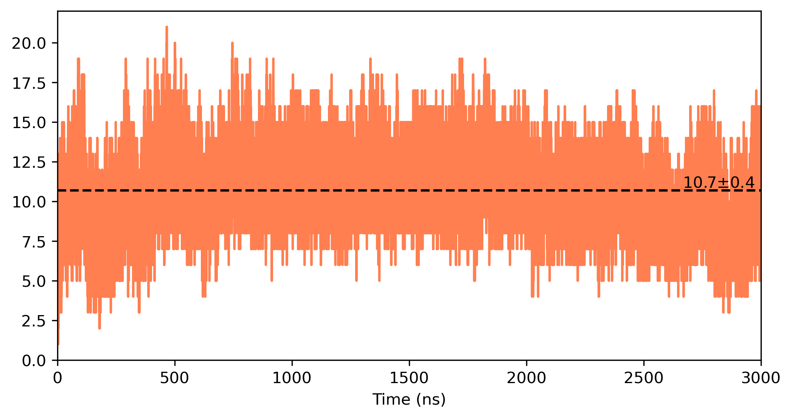

# Contact Analysis

## Generate diferent contacts from trajectory

Creates text files with the raw contact data from the trajectory

```
python contacts.py protein.tpr protein_nj_fitbb.xtc 0 999999 5.0 "bynum 1:6557" "bynum 13115:14918" phobic
python salt_bridges.py protein.tpr protein_nj_fitbb.xtc 0 999999 4.0 "bynum 1:6557" "bynum 13115:14918" salt
python hbonds.py protein.tpr protein_nj_fitbb.xtc 0 999999 3.5 30.0 "bynum 1:6557" "bynum 13115:14918" hbonds
```
## Count the number of contacts individually and by pairs

Using the generated text files creates a dat file with the count by pairs mode 0 or individual mode 1. Selection 1 first residue starts at 184 here it gets corrected from MDanalysis renumbering starting at 1. There are 848 residues before the second selection and this one must starts at 32 therefore -816 (-848+32) corrects it. 

```
python count.py hbonds.txt 184 -816 26102 hbonds_count --mode 0
python count.py hbonds.txt 184 -816 26102 hbonds_count --mode 1
```
## Generate a time series

```
python time_series.py hbonds.txt hbonds_count.dat 184 -816 26102 0.02 0.1 hbond_series
```

<p align="center">
  
  
</p>

## Create network maps

```
python network.py hbonds_count.dat hbond_salt 0.1 --auxmark 1 --auxfile salt_count.dat --rowsep 0.7
python network.py phobic_count.dat phobic 0.1 --rowsep 0.7
```

<p align="center">
  
</p>

## Map value to a pdb file

```
python paint_pdb.py protein.pdb hbonds_count_1.dat A tmp.pdb
python paint_pdb.py tmp.pdb hbonds_count_2.dat B final.pdb
```

<p align="center">
  
  
</p>
